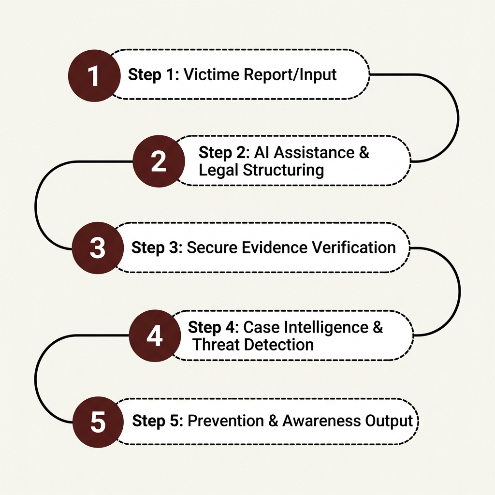
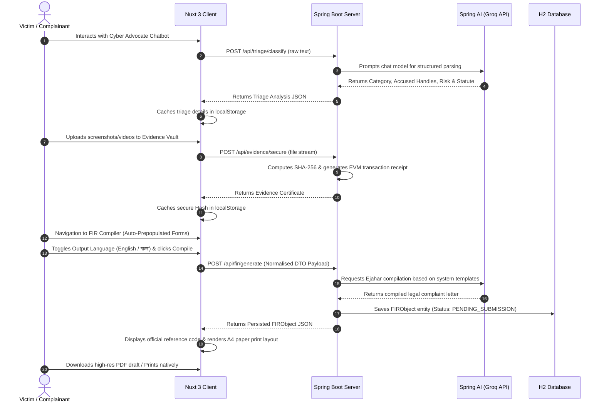

# 🛡️ CyberShield AI — Digital Safety & Justice Platform

CyberShield AI is a state-of-the-art, AI-driven digital safety, rights preservation, and incident reporting platform. Built specifically to empower victims of cybercrime under the **Bangladesh Cyber Security Act (CSA) 2023**, the platform provides an automated, legally supportive path from initial incident triage to official police report compilation.

The project features a **decoupled, full-stack architecture** combining a high-performance **Spring Boot 3.x API server** powered by **Spring AI** and a premium, responsive **Nuxt 3 single-page frontend** styled with Tailwind CSS.

---

## ✨ Features

### 1. 🤖 Dual-Pathway Reporting & Guided Chatbot
* **Guided Victim Chatbot**: An empathetic 13-step conversational wizard that interviews victims, gathering critical context (narrative, channels, offender profiles, threats, and impact) without overwhelming them.
* **Direct Triage Engine**: A high-efficiency direct pathway allowing users to paste pre-compiled chat histories or narrative transcripts directly for immediate evaluation.
* **Seamless Bridge Handoff**: Once the chat concludes, it automatically compiles a normalized profile, stores it in the global state, and navigates to the Triage page with an auto-analyze query parameter that immediately executes Spring AI classification.

### 2. 🔒 Cryptographic Evidence Vault
* **Tamper-Evident Anchoring**: Memory-efficient streaming hashing subsystem that hashes uploaded files (images, audio, video, chat logs) using **SHA-256** without loading large files into memory heap.
* **Mock Blockchain Ledger**: Returns an **EVM-style transaction certificate** (e.g., hash, 66-character transaction ID, and UTC timestamp) validating the integrity of the evidence.
* **Court Admissibility**: Archiving evidence hashes ensures legal verification and chain-of-custody tracking.

### 3. 📝 Bilingual FIR / Ejahar Compiler
* **Official Templates**: Automatically parses raw triage data to draft First Information Reports (FIRs) in **English** (matching Bangladesh Police Form No. 53 Ejahar skeleton) or **Bangla (বাংলা)** (official native prose layout).
* **A4 Physical Preview**: A beautifully designed interactive preview pane styled as physical paper with margins, official letterheads, seals, and professional typography (**Libre Baskerville** for Latin text and **Noto Serif Bengali** for Bangla script).
* **Dynamic PDF Export**: Integrated client-side `html2pdf.js` framework exporting high-definition drafts with **synchronized dynamic naming** matching the compiled language (`FIR_REPORT_BN_[YEAR]-[TIMESTAMP].pdf` vs `FIR_REPORT_EN_[YEAR]-[TIMESTAMP].pdf`).
* **Native Print Layout**: Configured `@media print` CSS overrides allowing users to instantly print compiled reports through standard system dialogue without headers or sidebars.

### 4. 🗄️ Relational Persistence & Workflow Tracking
* **Secure Database Hub**: Stored as JPA entities (`FIRObject`) containing all report data, reference numbers, AI-generated legal letters, and current processing statuses.
* **State Machine Transitions**: Tracks case lifecycle stage progress sequentially:
  $$\text{PENDING\_SUBMISSION} \longrightarrow \text{SUBMITTED} \longrightarrow \text{ACKNOWLEDGED} \longrightarrow \text{CLOSED}$$

---

## 📐 System Architecture

CyberShield AI uses a fully decoupled architecture connecting the client and the backend via a secure, CORS-compliant REST API.

```
                  ┌──────────────────────────────────────────┐
                  │          Nuxt 3 Frontend Client          │
                  │          (http://localhost:3000)         │
                  └────────────────────┬─────────────────────┘
                                       │
                                       │ HTTP / JSON
                                       ▼
                  ┌──────────────────────────────────────────┐
                  │         Spring Boot 3.x Backend          │
                  │          (http://localhost:8080)         │
                  └─────┬──────────────────────────────┬─────┘
                        │                              │
                        ▼                              ▼
             ┌─────────────────────┐        ┌─────────────────────┐
             │    Spring AI LLM    │        │  H2 Database / JPA  │
             │   (Llama-3.3-70b)   │        │     Persistence     │
             └─────────────────────┘        └─────────────────────┘
```

### Technical Stack
* **Frontend client**: Nuxt 3 (Vue 3, TypeScript, Pinia State Management, Tailwind CSS, html2pdf.js).
* **Backend API server**: Spring Boot 3.x (Java 17, Spring Web, Spring Data JPA, Spring AI Adapter, Groq API Integration, H2 Database Engine, Maven).

---

## 🧩 Core Architectural Engines & Workflows

CyberShield AI is structured into six key architectural components, each managing a distinct phase of the triage, proof securing, and threat mitigation lifecycle.

### 1. 🤖 Digital Victim Advocate & Guided Chatbot
* **Architecture**: A stateful conversational agent built as a modular Nuxt component (`TriageChatbot.vue`) that manages reactive dialogue steps and secure media uploads, bridging directly into the Spring Boot AI triage pipeline.
* **Workflow**:
  1. The victim responds to context-aware guided prompts (13 steps covering incident dates, offender details, safety concerns, and impact).
  2. At Step 13, the interface displays an interactive drag-and-drop vault drop-zone. The victim uploads screenshot evidence, which is instantly hashed and anchored via Spring Boot.
  3. Upon completion, a single-click handoff function (`finalizeChatAndTransfer()`) serializes the report, redirects the user, and auto-fires the Spring AI classification pipeline.

### 2. 📚 RAG Legal Engine (Retrieval-Augmented Generation)
* **Architecture**: Combining Spring AI's structured vector loaders with Groq/Llama-3.3 LLM embeddings. It integrates legal resources, procedural guidelines, and Ejahar complaint templates from the **Bangladesh Cyber Security Act 2023** into a searchable index.
* **Workflow**:
  1. During incident analysis, the engine extracts semantic key-phrases (e.g., "shared photos without permission", "extorted money via WhatsApp").
  2. It queries the local knowledge store to retrieve exact sections (e.g., Section 24 for Identity Impersonation, Section 28 for Offensive Speech) and relevant legal templates.
  3. The retrieved legal provisions are injected into the LLM system prompt context, ensuring that the generated complaint letter is legally grounded and uses correct statutory mappings.

### 3. 🏷️ Case Classification Engine
* **Architecture**: A high-performance classification pipeline that parses raw texts into strongly-typed Java records (e.g., `TriageAnalysis`) utilizing structured output converters (`BeanOutputConverter`) of Spring AI.
* **Workflow**:
  1. Accepts the raw conversational transcript from the Digital Victim Advocate.
  2. The LLM parses, identifies, and categorizes the incident into standard classes: **Cyber Harassment, Hacking, Impersonation, Blackmail, Cyberbullying, or Financial Fraud**.
  3. Outputs a normalized JSON payload containing the assigned class, computed risk score (1–100), severity label, primary offender details (handles, platforms), and legal justification notes, immediately updating the user's dashboard view.

### 4. 🔒 Secure Evidence Vault (Blockchain Layer)
* **Architecture**: A cryptographically secured caching repository integrated on the Spring Boot backend. It utilizes memory-efficient binary stream readers and Java `MessageDigest` APIs to compute file signatures.
* **Workflow**:
  1. Complainant uploads files (screenshots, video evidence, PDF exports, or chat logs) representing the crime proof.
  2. The backend streams the uploaded binary and generates a unique **SHA-256 fingerprint**.
  3. The fingerprint is anchored on a simulated blockchain layer, generating an EVM-style transaction certificate containing the evidence hash, a unique transaction hash (`0x...`), and a verified UTC timestamp.
  4. The certificate is stored on the client as a tamper-proof receipt to be appended directly to the final police Ejahar report.

### 5. 📡 Cyber Threat Intelligence System
* **Architecture**: An analytical backend service that processes anonymized incident data, checking for repeating patterns and entities.
* **Workflow**:
  1. On each successful FIR generation, the system parses and anonymizes victim names, storing the accused details (e.g., Telegram handle `@darkh4ck3r`, phone number, or profile ID) in the database.
  2. An intelligence daemon scans active case data to identify cross-victim correlations, detect repeat offenders, and plot regional/platform threat distribution maps.
  3. Feeds these threat patterns into the prevention layer for predictive threat mitigation.

### 6. 🚨 Early Warning & Prevention Layer
* **Architecture**: A rule-based and predictive safety monitoring layer built inside the client-side composables and backend alert notification hubs.
* **Workflow**:
  1. The Case Classification Engine checks if an incident's calculated risk score exceeds a critical threshold (e.g., $> 75$ or "Critical" blackmail).
  2. The system triggers immediate real-time safety warnings on the UI: advising the victim to immediately disable active accounts, take specific security steps, or contact nearby law enforcement units.
  3. Relevant emergency response recommendations are automatically attached to the printable draft Ejahar document for Duty Officers to fast-track high-risk cases.

---

## 🚀 How It Works





---

## 🛠️ Installation & Setup

### Prerequisites
Make sure you have the following installed on your machine:
* **Java Development Kit (JDK)**: Version 17 or higher
* **Node.js**: Version 18.x or higher (along with NPM or Yarn)
* **Maven**: (Maven wrapper `./mvnw` is included in the root directory)

---

### Step 1: Run the Spring Boot Backend

1. Navigate to the root directory where `pom.xml` is located.
2. Configure your AI model keys in `src/main/resources/application.properties` (or set the relevant environment variables).
3. Run the Spring Boot application using the Maven wrapper:
   ```bash
   ./mvnw spring-boot:run
   ```
4. The backend server will start and listen on **`http://localhost:8080`**.
5. You can access the in-memory H2 Database Console at **`http://localhost:8080/h2-console`** (JDBC URL: `jdbc:h2:mem:cybershield`, Username: `sa`, Password: *blank*).

---

### Step 2: Run the Nuxt 3 Frontend Client

1. Open a separate terminal window and navigate to the `/client` directory:
   ```bash
   cd client
   ```
2. Install the node package dependencies:
   ```bash
   npm install
   ```
3. Boot the Vite-powered Nuxt development server:
   ```bash
   npm run dev
   ```
4. The frontend server will start and listen on **`http://localhost:3000`**. Open this URL in your web browser.

---

## 🛰️ API Endpoint Summary

### Triage, Hashing & Evidence Preserving
* `POST /api/triage/classify` - Submits raw chatbot narrative transcript as `text/plain` and returns structured incident AI categories and risk labels.
* `POST /api/evidence/secure` - Receives multipart form-data file uploads and yields mock blockchain anchoring certificates and hashes (local path relative to temporary filesystem).
* `POST /api/evidence/upload` - Securely uploads and preserves evidence files (PNG, JPEG, PDF, Audio) during chat sessions inside the JVM temporary directory, computing SHA-256 fingerprints and EVM transaction receipts under traversal-protected UUID filenames.

### Ejahar Compiler (`FIRController.java`)
* `POST /api/fir/generate` - Builds and persists official Ejahar records, compiling them into a court-ready document in either language.
* `GET /api/fir/pending` - Yields a sequence of all compiled complaints awaiting official dispatch.
* `GET /api/fir/{id}` - Retrieves individual database records by ID.
* `GET /api/fir/ref/{referenceNumber}` - Fetches records matching official serial references (e.g. `CCID-CSA-2026-6885`).
* `PATCH /api/fir/{id}/status` - Advances workflow status across the safety ledger.

---

## 📄 License & Safety Disclaimer
This system is created strictly as an advisor platform for digital safety triage and legal complaint drafting. AI assessments, classifications, and statute mapping recommendations do not constitute official legal advice and must be verified by qualified law enforcement professionals before formal filing.
