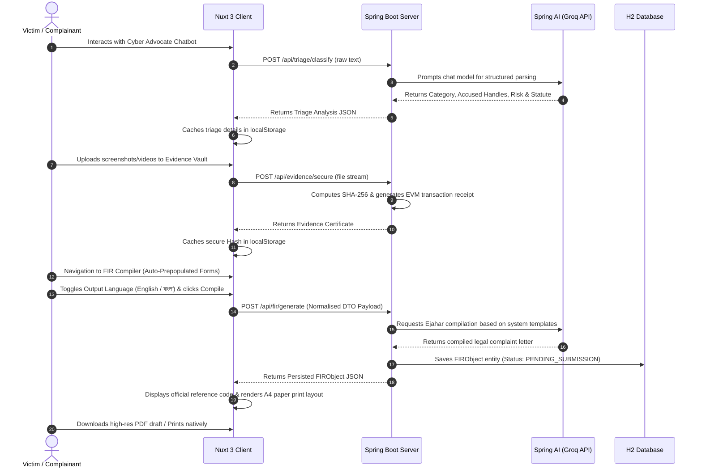

# 🛡️ CyberShield AI — Digital Safety & Justice Platform

CyberShield AI is a state-of-the-art, AI-driven digital safety, rights preservation, and incident reporting platform. Built specifically to empower victims of cybercrime under the **Bangladesh Cyber Security Act (CSA) 2023**, the platform provides an automated, legally supportive path from initial incident triage to official police report compilation.

The project features a **decoupled, full-stack architecture** combining a high-performance **Spring Boot 3.x API server** powered by **Spring AI** and a premium, responsive **Nuxt 3 single-page frontend** styled with Tailwind CSS.

---

## ✨ Features

### 1. 🤖 AI Advocate Chatbot Triage
* **Interactive Triage**: Guided conversation interface helping victims describe traumatic cyber incidents (blackmail, unauthorized access, harassment) in plain natural language.
* **Spring AI Engine**: Coordinates with LLMs (e.g., Llama-3.3 via Groq API) using strict structured JSON schemas to classify crimes, extract accused social media handles/phone numbers, assess severity, calculate risk scores, and map violations to corresponding sections of the CSA 2023.
* **Dynamic Prepopulation**: Incident logs are preserved and automatically forwarded to prepopulate subsequent legal documentation.

### 2. 🔒 Cryptographic Evidence Vault
* **Tamper-Evident Anchoring**: Memory-efficient streaming hashing subsystem that hashes uploaded files (images, audio, video, chat logs) using **SHA-256** without loading large files into memory heap.
* **Mock Blockchain Ledger**: Returns an **EVM-style transaction certificate** (e.g., hash, 66-character transaction ID, and UTC timestamp) validating the integrity of the evidence.
* **Court Admissibility**: Archiving evidence hashes ensures legal verification and chain-of-custody tracking.

### 3. 📝 Bilingual FIR / Ejahar Compiler
* **Official Templates**: Automatically parses raw triage data to draft First Information Reports (FIRs) in **English** (matching Bangladesh Police Form No. 53 Ejahar skeleton) or **Bangla (বাংলা)** (official native prose layout).
* **A4 Physical Preview**: A beautifully designed interactive preview pane styled as physical paper with margins, official letterheads, seals, and professional typography (**Libre Baskerville** for Latin text and **Noto Serif Bengali** for Bangla script).
* **Dynamic PDF Export**: Integrated client-side `html2pdf.js` framework exporting high-definition drafts with **synchronized dynamic naming** matching the compiled language (`FIR_REPORT_BN_[YEAR]-[TIMESTAMP].pdf` vs `FIR_REPORT_EN_[YEAR]-[TIMESTAMP].pdf`).
* **Native Print Layout**: Configured `@media print` CSS overrides allowing users to instantly print compiled reports through standard system dialogue without headers or sidebars.

### 4. 🗄️ Relational Persistence & Workflow Tracking
* **Secure Database Hub**: Stored as JPA entities (`FIRObject`) containing all report data, reference numbers, AI-generated legal letters, and current processing statuses.
* **State Machine Transitions**: Tracks case lifecycle stage progress sequentially:
  $$\text{PENDING\_SUBMISSION} \longrightarrow \text{SUBMITTED} \longrightarrow \text{ACKNOWLEDGED} \longrightarrow \text{CLOSED}$$

---

## 📐 System Architecture

CyberShield AI uses a fully decoupled architecture connecting the client and the backend via a secure, CORS-compliant REST API.

```
                  ┌──────────────────────────────────────────┐
                  │          Nuxt 3 Frontend Client          │
                  │          (http://localhost:3000)         │
                  └────────────────────┬─────────────────────┘
                                       │
                                       │ HTTP / JSON
                                       ▼
                  ┌──────────────────────────────────────────┐
                  │         Spring Boot 3.x Backend          │
                  │          (http://localhost:8080)         │
                  └─────┬──────────────────────────────┬─────┘
                        │                              │
                        ▼                              ▼
             ┌─────────────────────┐        ┌─────────────────────┐
             │    Spring AI LLM    │        │  H2 Database / JPA  │
             │   (Llama-3.3-70b)   │        │     Persistence     │
             └─────────────────────┘        └─────────────────────┘
```

### Technical Stack
* **Frontend client**: Nuxt 3 (Vue 3, TypeScript, Pinia State Management, Tailwind CSS, html2pdf.js).
* **Backend API server**: Spring Boot 3.x (Java 17, Spring Web, Spring Data JPA, Spring AI Adapter, Groq API Integration, H2 Database Engine, Maven).

---

## 🚀 How It Works



---

## 🛠️ Installation & Setup

### Prerequisites
Make sure you have the following installed on your machine:
* **Java Development Kit (JDK)**: Version 17 or higher
* **Node.js**: Version 18.x or higher (along with NPM or Yarn)
* **Maven**: (Maven wrapper `./mvnw` is included in the root directory)

---

### Step 1: Run the Spring Boot Backend

1. Navigate to the root directory where `pom.xml` is located.
2. Configure your AI model keys in `src/main/resources/application.properties` (or set the relevant environment variables).
3. Run the Spring Boot application using the Maven wrapper:
   ```bash
   ./mvnw spring-boot:run
   ```
4. The backend server will start and listen on **`http://localhost:8080`**.
5. You can access the in-memory H2 Database Console at **`http://localhost:8080/h2-console`** (JDBC URL: `jdbc:h2:mem:cybershield`, Username: `sa`, Password: *blank*).

---

### Step 2: Run the Nuxt 3 Frontend Client

1. Open a separate terminal window and navigate to the `/client` directory:
   ```bash
   cd client
   ```
2. Install the node package dependencies:
   ```bash
   npm install
   ```
3. Boot the Vite-powered Nuxt development server:
   ```bash
   npm run dev
   ```
4. The frontend server will start and listen on **`http://localhost:3000`**. Open this URL in your web browser.

---

## 🛰️ API Endpoint Summary

### Triage & Hashing (`TriageController.java`)
* `POST /api/triage/classify` - Submits raw chatbot narrative transcript as `text/plain` and returns structured incident AI categories and risk labels.
* `POST /api/evidence/secure` - Receives multipart form-data file uploads and yields mock blockchain anchoring certificates and hashes.

### Ejahar Compiler (`FIRController.java`)
* `POST /api/fir/generate` - Builds and persists official Ejahar records, compiling them into a court-ready document in either language.
* `GET /api/fir/pending` - Yields a sequence of all compiled complaints awaiting official dispatch.
* `GET /api/fir/{id}` - Retrieves individual database records by ID.
* `GET /api/fir/ref/{referenceNumber}` - Fetches records matching official serial references (e.g. `CCID-CSA-2026-6885`).
* `PATCH /api/fir/{id}/status` - Advances workflow status across the safety ledger.

---

## 📄 License & Safety Disclaimer
This system is created strictly as an advisor platform for digital safety triage and legal complaint drafting. AI assessments, classifications, and statute mapping recommendations do not constitute official legal advice and must be verified by qualified law enforcement professionals before formal filing.
